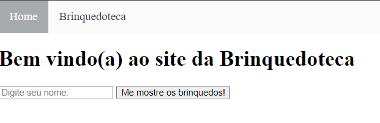
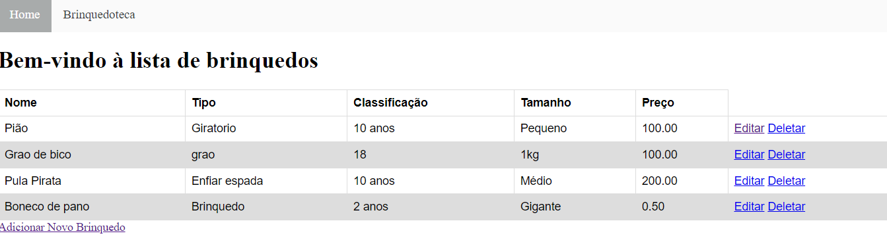
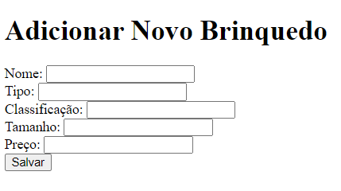

<div align="center" id="top"> 
  
  <h1 align="center">Brinquedoteca</h1>
</div>

<p align="center">
  
  
  
</p>

<p align="center">
  <a href="https://github.com/CharCarvalho" target="_blank">Autor</a>
</p>

## 📝 Sobre

O projeto **Brinquedoteca** é uma aplicação web desenvolvida em Java usando Spring Boot e Thymeleaf. A aplicação permite gerenciar uma lista de brinquedos, oferecendo operações CRUD (Criar, Ler, Atualizar, Deletar) de forma simples e eficiente. O projeto inclui uma interface web intuitiva para que os usuários possam visualizar, adicionar, editar e excluir brinquedos.

## ✨ Funcionalidades

- ✅ Página de boas-vindas que solicita o nome do usuário.
- ✅ Listar brinquedos cadastrados no sistema.
- ✅ Adicionar novo brinquedo.
- ✅ Atualizar informações de brinquedos existentes.
- ✅ Remover brinquedos do sistema.

## 🚀 Tecnologias

As seguintes ferramentas foram utilizadas neste projeto:

- [Java Spring Boot](https://spring.io/projects/spring-boot)
- [Thymeleaf](https://www.thymeleaf.org/)
- [Eclipse IDE](https://www.eclipse.org/)
- [Azure Static Web Apps](https://azure.microsoft.com/en-us/services/app-service/static/)

## ✔️ Requisitos

Antes de começar, certifique-se de ter [Git](https://git-scm.com) e [Java JDK](https://www.oracle.com/java/technologies/javase-jdk11-downloads.html) instalados.

## 🏁 Começando

```bash
# Clone este projeto
$ git clone https://github.com/CharCarvalho/Brinquedoteca

# Acesse o diretório
$ cd Brinquedoteca

# Compile e execute o projeto
$ ./mvnw spring-boot:run

# A aplicação estará disponível em http://localhost:8080
```

## 📂 Estrutura do Projeto

O projeto está organizado da seguinte forma:

- **`/src/main/java`**: Contém o código-fonte da aplicação.
- **`/src/main/resources`**: Contém arquivos de configuração e templates Thymeleaf.
- **`/src/test/java`**: Contém os testes automatizados da aplicação.

## 🌐 Navegando pela Aplicação

### Página Inicial

- **URL:** `/`
- **Descrição:** Página que solicita o nome do usuário e direciona para a lista de brinquedos.

### Listar Brinquedos

- **URL:** `/brinquedoteca`
- **Descrição:** Exibe a lista de brinquedos cadastrados.

### Adicionar Brinquedo

- **URL:** `/brinquedoteca/create`
- **Descrição:** Formulário para adicionar um novo brinquedo ao sistema.

### Editar Brinquedo

- **URL:** `/brinquedoteca/edit/{id}`
- **Descrição:** Formulário para editar as informações de um brinquedo existente.

### Deletar Brinquedo

- **URL:** `/brinquedoteca/delete/{id}`
- **Descrição:** Deleta o brinquedo especificado.

## 🖥️ Interface da Aplicação

### Página Inicial



### Lista de Brinquedos



### Formulário de Adição



## 🚀 Deploy

O projeto foi implantado no Azure e pode ser acessado pelo link abaixo:

- **[Brinquedoteca no Azure](https://cp4-brinquedoteca-gke6b0azexbfdzbg.eastus2-01.azurewebsites.net/)**
